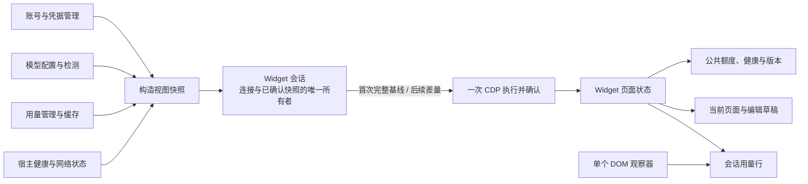

# 架构审查与重构：状态、持久化、协议与页面

本次按产品交互、页面渲染、同步调度、数据来源、持久化、外部协议及构建入口逐层检查。主要问题是状态所有权分散、提前发布未持久化状态，以及在多层重复做同一件事。先完成页面链重构，再扩展到账号、模型配置、Schema、用量归属和构建代码，没有增加运行依赖或更换框架。

续审已全文阅读 `src` 的 150 个文件和 `scripts` 的 48 个文件，以及安装器、构建 workflow、四个开发启动入口和预览页面。内置模型 JSON 的两份相同提示词经内容比对后解码阅读一份。阅读不等于每条分支都获得运行验证；测试代码只完整阅读了部分文件，不能声称仓库每个文件都逐行审查完成。逐文件阅读记录及当时 SHA-256 保存在 `.runtime/full-review/coverage.json`，修改后的文件以已读全文加最终 diff 复核为依据。既有其他任务的 Relay、宿主健康和启停改动不归入本次重构成果。

账号、计费和模型能力的业务语义保持原边界。没有因为跨模块功能看起来复杂而删除迁移补偿、凭据隔离、消息归属或历史保护，也没有将未经对照确认的上游/环境现象当作项目缺陷修改。

## 已确认并处理的问题

| 层次 | 原设计与真实触发条件 | 本次处理 |
| --- | --- | --- |
| 用户交互 | 模型管理打开时，`update()` 提前返回。后台额度从 77% 变到 42%，页面仍显示 77%；公共健康状态和版本同样停住 | 公共状态与页面内容分别更新。额度入口、健康指示、诊断和版本保持刷新，模型表单节点、草稿、焦点不重建 |
| DOM 观察 | 整页观察器和会话子树观察器覆盖同一区域；已有用量行的流式正文仍触发每帧根节点查询；另外还要维护子树发现与重新绑定 | 删除会话专用观察器、祖先搜索和重新绑定。保留一个覆盖整页的结构观察器；只有相关节点变化才发现回合，只有挂载丢失才重新挂载 |
| 同步所有权 | 重连、重启、热更新、安装恢复分别重置同一组缓存和 revision；外层可以逐项写入同步模块私有状态 | 会话独占连接、安装状态、已确认快照和编号。外层只使用 `reset()`、`whenIdle()`、标记变更和请求更新 |
| 重连一致性 | 每个新发送方从 revision 1 开始，幸存页面也可能记着 1，首次完整快照被当成重复消息忽略 | revision 包含连接唯一标识。每次新连接或显式重置都重新发送完整基线，不继承其他连接的确认状态 |
| 异步一致性 | 健康检查、安装和数据发送之间可以发生连接替换或同一连接重置；旧异步结果可能继续写入新的同步状态 | 每个异步边界检查同一个会话对象是否仍有效；旧结果不能确认新会话的快照 |
| 传输成本 | 同一批账号、网络、用量变化需要依次三次 CDP 请求；缺失 Widget 时可选调用返回空值仍被当作发送成功 | 同批通道在一次浏览器任务中执行，返回明确确认。页面消失则重装并发完整快照，异常时保留待同步数据 |
| 内部复杂度 | 完整静态模型与去除额外模型后的静态模型分别序列化；固定依赖也用 getter 转交 | 基础页面数据、模型数据、网络和用量分别比较。固定依赖直接传递，可变连接与运行时才使用 getter |
| 账号持久化 | 切换账号先修改内存 current/lastUsed，再写文件；写入失败会留下未保存的当前账号。导入失败也可能把不存在的账号文件写进索引 | 构造候选账号集合，索引落盘后统一发布；复用 upsert 的跨文件补偿。导入仅收录已成功写出的账号 |
| 凭据错误边界 | macOS `security` 失败时，`execFile` 异常包含完整参数；直接拼接异常消息会把 Token 带到日志和 UI | 边界转为不含命令参数的固定错误，不附带原异常 cause |
| 模型与上下文配置 | 候选平台重复克隆；未发布的 settings 仍写一套回滚；上下文覆盖提前修改内存再用 catch 回滚，队列另建手动 release Promise | 单次构造候选，持久化后发布。上下文三种写操作共用提交点；用 Promise 尾链串行，单次失败不阻断后续操作 |
| Responses 兼容 | 直接兼容代理先规范化工具 Schema，进入桥接适配器又编译一遍 | 能力策略负责字段选择，所选协议适配边界负责一次 Schema 编译；保留输出与调用方对象隔离 |
| Schema 编译 | 编译器会构造结果，入口仍深克隆整棵树；`if (!target)` 把合法 false 引用当缺失，allOf 合取 false 后继续赋字段会抛错 | 删除预克隆；缺失判断使用 null；false 合取直接终止。补充源对象及两个引用分支的隔离用例 |
| 子任务用量 | 每份子任务元数据、每个子回合反复遍历全部回合并排序 | 每批一次按任务分组并准备时间索引，保留深度处理顺序、根回合继承和时间回退规则；不引入长期缓存和失效机制 |
| Windows 构建 | Relay SEA 脚本复制已有的 Authenticode 移除、postject 判定和产物检查 | 复用两个既有公共模块，删除约 70 行重复实现；保留原构建顺序和失败条件 |

同批执行保证中间状态不被其他浏览器任务插入，但不是数据库事务：某个渲染函数抛错时，之前的 DOM 修改可能已经发生。发送端不确认这批快照，下次用新 revision 重发并收敛，已有用例覆盖这一情况。

## 采用的架构

职责规则是：数据管理器解释业务数据；会话解释“当前连接确认到了哪里”；渲染器解释“哪些可见节点需要更新”。恢复和去重状态跟随其所有者，不再由上层知道并维护内部字段。

持久化遵循“旧状态 → 候选状态 → 落盘 → 发布”。单文件提交无需内存回滚；账号跨文件操作保留必要补偿。协议链遵循“路由 → 能力策略 → 所选适配器 → 上游”，不在每层重复编译同一份 Schema。索引仅服务当前一批用量归属计算，避免再引入跨批次一致性问题。

- **连接失效**：废弃整个连接状态，不能拼凑旧差量缓存。
- **首次发送**：完整基线，使用连接独立的 revision。
- **后续发送**：基础信息、模型、网络、用量按变化选择通道，同批一次发送。
- **并发通知**：合并正在进行的请求；发送期间发生的新变化随后送达。
- **界面更新**：公共状态独立于编辑页；模型进度继续局部更新，账户刷新继续保留导入表单。
- **无相关变化**：不发送更新、不重新发现会话根节点。必要健康探测维持原间隔。

比较过整体替换状态框架、取消差量改为全量推送、统一重建所有页面三种方向。它们分别增加依赖与注入序列化成本、重新传输历史明细、破坏编辑焦点；当前实现用既有接口收紧所有权，改动和验证范围更清楚。本次没有重新定义业务能力，也没有把“代码更短”当作唯一目标。

## 有功能依据的保护及后续方向

| 模块 | 审查判断 |
| --- | --- |
| 账号与迁移 | 按账号串行处理、刷新后的凭据交接、临时迁移不交付 refresh token、完整转移停用源账号等都对应明确的业务状态，保留。本次收紧 AccountStore 的提交点，保留跨账户库、官方凭据和文件系统的迁移补偿 |
| Router / Relay | 官方流量保留原始字节、自定义模型才进入兼容适配；平台、任务和供应商边界有实际语义。不把所有请求统一转换为 Chat，也不合并原生平台的进程边界 |
| 能力检测 | 临时网络故障与明确协议不兼容分别处理，避免一次超时改变保存的路由。重复的 HTTP 请求实现可以在独立改动中收敛，但当前不是已测性能瓶颈 |
| 用量管理 | Worker 重建 rollout 会先清除旧投影，再异步补入记录。页面的短时稳定视图有上游状态依据，本次保留五秒保护并补回归。更干净的后续方案是在数据管理器完成投影后一次发布，再移除显示层时间窗口；直接删窗口会暴露中间空视图 |
| 操作调度 | `TARGET_POLL_MS = 1500` 仍用于取出页面动作，用户动作可能等待下一次轮询。下一步可独立验证 CDP binding 驱动的动作队列，将进程存活检查与操作处理分离；必须同时验证绑定恢复、动作顺序、长任务和重连，不能用缩短轮询冒充事件驱动 |
| 启停与宿主健康 | 本轮已有其他未提交改动。只保留接入边界，未重写其所有权、历史和平台验证逻辑，也未重新宣称跨平台验收通过 |

这些是有证据的保留理由或候选方向，不把尚未实施、尚未测量的设计描述为已经优化完成。

## 验证与实际收益

前一阶段页面链 **49/49** 个自动化检查通过：同步和开发热加载 17 项、桥接契约 1 项、Widget 真实浏览器 30 项、同浏览器前后对照 1 项。浏览器覆盖模型编辑、检测结果回填、账户和唤醒页面、焦点、滚动、缩放、主题、任务切换、侧栏重建、版本替换与销毁，以及压缩打包后的序列化和交互。该阶段之后的后台修改另行定向验证，不将这 49 项当成新后台代码的验收结果。

同一 macOS arm64、Node 26.7.0、Chrome 153.0.8010.48、相同模拟材料对照：

| 指标 | 重构前 | 重构后 |
| --- | --- | --- |
| 连续 6 次正文流式更新引起的会话根查询 | 6 次 | 0 次 |
| 一批账号、网络和用量变化的 CDP 往返 | 3 次 | 1 次 |
| 旧页面保留 revision 1、新发送方首次重连后的额度 | 错误保留 77% | 正确更新 42% |
| 模型编辑页收到公共额度更新 | 错误保留 77% | 正确更新 42%，保留表单节点和焦点 |

这些指标说明相关工作量降低，不是整机 CPU、端到端模型速度或所有平台的性能承诺。没有运行完整免费回归、真实模型、原生 Relay 或启停恢复测试。原始失败、修复后结果、输入摘要和边界见[脱敏测试报告](test-reports/macos-native/2026-09-17-widget-refactor.md)。

续审完成后统一运行 14 个定向测试文件，**67/67 通过，0 失败、0 跳过**；测试期间输入没有变化。覆盖上下文三种操作的真实落盘失败与恢复、模型保存/检测并发、原生和桥接 Responses 的工具 Schema、Chat 续接、Router 能力边界，以及 Windows 构建公共函数的模拟 PE 文件。没有把 macOS 上的公共函数验证写成 Windows 原生构建通过。

同一批 1,400 个回合、100 份子任务元数据的新旧实现输出完全一致，遍历完整回合集合的次数从 **400 次降到 1 次**，被访问回合数从 560,000 降到 1,400。这是确定性工作量对照，不是耗时跑分，也不代表整个用量处理算法的总复杂度降为常数。此前账号/凭据 56/56 和子任务集成 2/2 保留原执行结果，不计入本轮 67 项；详见[续审测试报告](test-reports/macos-native/2026-09-17-state-protocol-refactor.md)。

本任务涉及的生产与构建文件相对 HEAD 净减少 **256 行**，不计测试、文档，也不计其他任务的既有改动。应用版本和依赖未因本任务额外变更。

Widget 运行时从 172 升至 173。应用版本保留工作区已有的 0.1.283，本次没有提交。续审修改请求兼容行为，Relay 协议从工作区的 84 升到 85；持久化结构和缓存语义不变，不升级其内部版本。前一阶段只读取证时日常正式实例为 **0.1.282 / Widget 172**，不能将该时点记录推定为永久当前状态。临时浏览器已加载、重装并验证 Widget 173；本任务没有执行日常接管或重启，后台源码修改不等于日常实例已生效。
