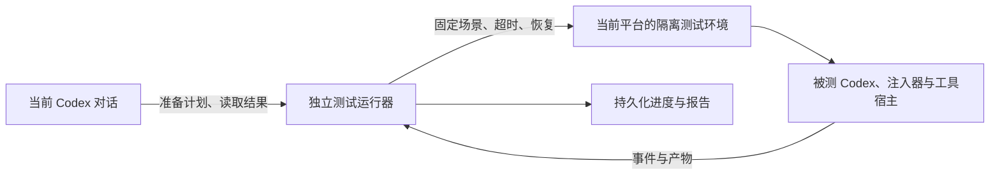

# Codex 兼容性测试方案与覆盖矩阵

状态：免费契约、实际官方运行时、生产模型目录与中继、隔离浏览器、B 执行入口和独立 C 生命周期监督器已实现。A 已按公共、Windows 原生 Relay、WSL 原生 Relay 拆分；Windows C 会自动切换两套运行环境并恢复原配置。当前结果见[测试说明](testing.md)及本次运行报告；真实模型、桌面宿主和 Windows 真机生命周期仍必须分别执行验收。本文不是整套测试通过报告。

## 1. 验收目标与平台范围

每次修改项目后，验证本项目可能影响的 Codex 功能。computer use、web.run 是故障样本，不能限定测试范围。覆盖对象包括启动、配置、协议、工具、任务状态、权限、输入输出、账号、注入界面、运行资源和正式产物。

**在哪个平台测试，就验证该平台的适用场景，不强制跨平台验收。** 一次报告绑定操作系统、架构、Codex 版本、注入器代码快照、入口形态和测试配置。macOS arm64 的结果不要求 Windows、WSL 或 Intel Mac 同时通过，也不能替它们背书。其他平台记为“范围外”；当前平台缺少测试、执行失败或环境未准备好，必须如实记录。

“覆盖完整”指本次范围内的影响面均有已执行的验收证据；不以文件覆盖率、测试数量、模型回复“完成了”或没有异常日志替代。新能力必须进入清单，不能承诺尚未出现的 Codex 版本已经兼容。

## 2. 最初盘点的历史基线

2026-09-12 最初盘点时（本节保留历史，用例数与缺口不是当前完成状态）：

- 文档复核时项目工作区版本为 `0.1.192`，存在未提交的实现、测试及 CI 改动。工作区在盘点期间持续更新，这些数值属于读取快照；后续执行必须重新采集版本和内容摘要。本次只编写测试设计文档，不据此推断历史 Release 执行过哪些测试。
- 复核时默认测试源文件定义了 87 个顶层测试，真实账号测试定义了 1 个。这里统计的是已定义用例，未在本轮运行 `npm test` 或 `npm run test:live`。
- 本机 macOS 官方客户端版本为 `26.903.71938`，内置 `codex-cli 0.153.4`。已在临时配置目录执行版本读取和协议导出，没有发送模型请求。
- 默认协议导出包含 99 个客户端请求、10 个服务端请求、1 个客户端通知、81 个服务端通知；加 `--experimental` 后分别为 155、11、1、81，共 248 个消息分支。
- [协议清单](testing-protocol-inventory.json) 保存全部方法名、对应 Schema 文件摘要和请求的方案归属。Schema 枚举不表示这些能力已在当前账号开放，也不能替代桌面工具、插件工具和远程服务的实际能力清单。

官方支持按运行的 CLI 版本生成协议 Schema，并将部分方法和字段放在实验能力开关后。升级比较要同时检查方法和字段，不能只比较名称。[官方 app-server 文档](https://learn.chatgpt.com/docs/app-server)

### 2.1 现有测试证据索引

下文使用 E 编号定位已有用例。所有“已有”均只描述测试代码的断言范围，不表示本轮执行通过。

| 编号 | 文件与用例数 | 已有业务断言 | 不能据此推出的结论 |
| --- | --- | --- | --- |
| E01 | [account-manager.test.mjs](../test/account-manager.test.mjs)，12 | 凭据格式、额度请求、刷新、工作区匹配、凭据写回 | OAuth 浏览器流程、Keychain 交接和桌面切换恢复已完成 |
| E02 | [account-store.test.mjs](../test/account-store.test.mjs)，5 | 加密、篡改检测、持久化、迁移、唤醒时间 | 全部写入失败和并发操作场景已覆盖 |
| E03 | [account-wakeup.test.mjs](../test/account-wakeup.test.mjs)，5 | 时间设置、幂等占位、休眠跳过、异常恢复、刷新失败 | 官方唤醒子进程的异常路径已验证 |
| E04 | [model-configuration.test.mjs](../test/model-configuration.test.mjs)，9 | DeepSeek/额外模型、目录、上下文、外部配置保护、Swift shim 参数 | 真实官方参数解析、完整启动决策和模型功能已验证；其中目录探测和 shim 使用假 CLI |
| E05 | [model-router.test.mjs](../test/model-router.test.mjs)，14 | HTTP/WS、辅助与未知 API、鉴权、路由、能力拒绝、重连、usage | 工具已执行、官方任务已压缩或主入口已完成任务；上游为本地模拟服务 |
| E06 | [app-server-relay.test.mjs](../test/app-server-relay.test.mjs)，1 | 模型列表、新任务、新轮次、环境与 usage 的一条组合流程 | 所有 RPC 和任务生命周期已覆盖；上游是假 CLI，Windows 跳过该用例 |
| E07 | [chat-compat-proxy.test.mjs](../test/chat-compat-proxy.test.mjs)，6 | 文本/图片转换、工具历史关联、SSE 截断、原生透传 | 真实 Codex 执行工具及供应商全部能力已验证 |
| E08 | [runtime-contracts.test.mjs](../test/runtime-contracts.test.mjs)，11 | CDP、就绪、进程识别、单实例协议、Widget 数据桥、格式计算和工具列表 | 完整 launcher/injector 生命周期、真实页面挂载、窗口点击已验证 |
| E09 | [token-usage.test.mjs](../test/token-usage.test.mjs)，13 | 去重、压缩计量、并发任务、子任务、缓存、Worker 回退、工具账本关联 | 压缩、子智能体和这些工具实际可用；此处测试的是记录解析 |
| E10 | [tool-executions.test.mjs](../test/tool-executions.test.mjs)，6 | 原生工具类型识别、同名调用、时间归属、脱敏摘要、命令与完整列表投影 | 清单中的 web、MCP、图像和协作工具都执行成功 |
| E11 | [token-pricing.test.mjs](../test/token-pricing.test.mjs)，5 | 价格、长上下文分层、未知价格、汇率缓存 | 估价等于 OAuth 额度或实际账单 |
| E12 | [current-account-smoke.test.mjs](../live-tests/current-account-smoke.test.mjs)，1 | 当前 OAuth 账号通过独立官方唤醒进程回复 OK | 日常主入口、shim/relay、Router、桌面工具和完整任务可用 |

### 2.2 实际代码触点

| 触点 | 直接代码与职责 |
| --- | --- |
| 启动 | [launcher.mjs](../src/launcher.mjs) 的入口分派、单实例与复用/重启；[macos-launcher.swift](../src/macos-launcher.swift) 的原生入口事件；[single-instance.mjs](../src/single-instance.mjs) 的接管协议 |
| 平台 | [platform.mjs](../src/platform.mjs) 的可执行文件发现、Store 文件准备、Windows/WSL 识别、启动和进程就绪 |
| 启动配置 | [codex-bridge.mjs](../src/codex-bridge.mjs) 的 `prepareCodexLaunch`；[macos-shim.mjs](../src/macos-shim.mjs) 与 [macos-codex-shim.swift](../src/macos-codex-shim.swift) 的原生 exec |
| RPC 中继 | [app-server-relay.mjs](../src/app-server-relay.mjs) 的参数注入、`rewriteClientLine`、`rewriteServerLine`、状态学习、标准流与信号；[windows-relay-entry.mjs](../src/windows-relay-entry.mjs)、[wsl-relay-entry.mjs](../src/wsl-relay-entry.mjs) |
| 模型网络 | [model-router.mjs](../src/model-router.mjs) 的 HTTP、辅助接口、WS、路由状态、凭据与用量观察；[chat-compat-proxy.mjs](../src/chat-compat-proxy.mjs) 的 Responses/Chat 转换与工具历史 |
| 模型配置 | [codex-context.mjs](../src/codex-context.mjs)、[official-model-catalog.mjs](../src/official-model-catalog.mjs)、[deepseek-manager.mjs](../src/deepseek-manager.mjs)、[deepseek-model.json](../src/deepseek-model.json)、[extra-model-manager.mjs](../src/extra-model-manager.mjs) |
| 账号 | [account-manager.mjs](../src/account-manager.mjs) 的 OAuth、监听、刷新、切换与 Keychain；[account-store.mjs](../src/account-store.mjs) 的加密和写入队列 |
| 定时唤醒 | [account-wakeup.mjs](../src/account-wakeup.mjs) 的状态机；[wakeup-client.mjs](../src/wakeup-client.mjs) 的独立官方进程、选模型、登录、取消与清理 |
| 页面 | [injector.mjs](../src/injector.mjs) 的连接、动作队列、刷新与重启；[cdp-client.mjs](../src/cdp-client.mjs) 的目标与 RPC；[widget.mjs](../src/widget.mjs) 的 DOM、事件、数据与销毁 |
| 观察与诊断 | [token-usage.mjs](../src/token-usage.mjs)、[tool-executions.mjs](../src/tool-executions.mjs)、[token-pricing.mjs](../src/token-pricing.mjs)、[file-logger.mjs](../src/file-logger.mjs)；[cli.mjs](../src/cli.mjs) 与 [preview-server.mjs](../src/preview-server.mjs) |
| 产物 | [scripts](../scripts)、[Windows 安装器](../installer/windows-installer.nsi)、[relay-artifact.mjs](../src/relay-artifact.mjs)、[relay-contract.mjs](../src/relay-contract.mjs)、[打包工作流](../.github/workflows/build-packages.yml) |

macOS 在无模型扩展/上下文覆盖时可以走官方直接路径；需要静态目录时使用原生 shim；需要自定义路由时由 shim 先进入 RPC relay，再由 Router 转发模型网络请求。RPC relay 负责让新建、恢复和分叉持续携带模型供应商，Router 负责目标选择、凭据隔离和协议兼容。Windows 原生模式使用版本化的 Windows SEA relay，WSL 模式使用版本化的 Linux SEA relay，自定义供应商由 relay 内置路由处理。必须按这些实际分支组织配置，不能用一个平台的通过结果替代另一个平台，也不能把独立唤醒链当作桌面主链。

### 2.3 后续落地的公共链路回归

以下追加证据不覆盖 2.1 的历史盘点快照，也不把对应场景整行标记为已完成。

| 编号 | 文件 | 新增断言与范围 |
| --- | --- | --- |
| E13 | [relay-protocol.test.mjs](../test/relay-protocol.test.mjs)，9 组 | RPC-02/03/04/05、MOD-01/05、SES-01、OBS-02 的部分契约：双向外壳、ID 匹配、分页、分片、大历史、任务响应模型、迟到失败和观察写入失败；上游仍是 Node 材料进程 |
| E14 | [chat-tool-contracts.test.mjs](../test/chat-tool-contracts.test.mjs)，13 组 | TOOL-01/07、NET-02/04/05、MOD-03 的工具续接、历史归属、指定函数、流式终态与故障恢复；没有实际执行官方工具宿主 |
| E15 | [model-router-recovery.test.mjs](../test/model-router-recovery.test.mjs)，5 组 | NET-04/05、MOD-03、OBS-02 的生产 Router/Chat 组合、并发凭据隔离、取消与错误恢复、观察故障和用量；上游全部为本地服务 |
| E16 | [deepseek-history.test.mjs](../runtime-tests/deepseek-history.test.mjs)，1 组 | MOD-03、SES-01/02/06 的实际官方 app-server → 当前原生生产中继入口 → 本地 Responses 服务；macOS 经过 shim/Router，Windows 与 WSL 分别经过实际 PE/ELF SEA Relay，使用各自 Node.js、依赖、官方 CLI 与临时目录。用 `reasoning_text` 流复现 Codex 推理历史，验证恢复和分叉继承 DeepSeek 供应商、工具历史保持关联、第三方供应商采用本地摘要压缩并在压缩后续接，同时剥离私有消息元数据及 DeepSeek 不支持的 `summary`/`encrypted_content` |
| E17 | [deepseek-tools.test.mjs](../runtime-tests/deepseek-tools.test.mjs)，1 组 | MOD-03、TOOL-03、INT-02 的实际官方 app-server → 当前原生生产中继入口 → 本地 Responses/MCP 服务；Windows 与 WSL 各自执行，结果不能互相继承。固定 DeepSeek 直接工具模式必须在首次请求暴露 MCP 命名空间，并在 `never` 下通过只读 MCP 验证直调、模型调用、结果回灌和独立事件，防止错误启用延迟搜索后工具失效或模型循环 |

E13–E15 进入 `npm test`，E16–E17 进入 `npm run test:offline`。完整证据索引见[场景索引](testing-scenarios.json)及[测试说明](testing.md)。方法名回放仅验证消息外壳和未改写数据，不声称符合每个方法的完整参数 Schema，也不代替对应业务功能验收。

## 3. 三批测试及公共验收规则

### A：不消耗 Token

- `A-common`：共享逻辑、状态机、Router、协议样本、故障注入和页面/浏览器契约，只执行一次。
- `A-macos-native-relay`：macOS Node.js、官方 CLI 与生产 shim/Relay 的实际组合。
- `A-windows-native-relay`：Windows Node.js、Windows 依赖与缓存、Windows 官方 CLI、实际 PE SEA Relay、Windows 路径/进程/临时目录。
- `A-wsl-native-relay`：WSL Linux Node.js、独立依赖与缓存、WSL 官方 CLI、实际 ELF SEA Relay、Linux 环境变量、路径转换与进程身份。

A 套件必须用临时工作区、临时配置、测试凭据和可记录请求的本地模型端点。macOS 使用 Seatbelt 将运行时限制到回环服务，临时 Chrome/Edge 额外使用模拟钥匙串；Windows 原生使用临时 HOME/APPDATA，WSL 把源码复制到 Linux 临时工作区后独立执行 `npm ci` 并使用临时 HOME、依赖与缓存。若请求未到本地服务，或者出现真实上游的网络/认证结果，测试必须失败并保留证据。联网但不调用模型的检查单独标注网络依赖。离线测试的工具结果应由真实测试文件、进程或服务产生。报告必须同时给出当前桌面运行环境状态与当前平台全部支持环境状态；公共证据可复用，原生 Relay 结果不得继承。

真实桌面的多实例、配置目录、单实例端口、认证存储和工具宿主能否完整隔离尚待验证；仅设置 `CODEX_HOME` 不足以证明隔离。优先使用与当前平台对应的独立测试环境或虚拟机。专用系统用户也需要验证共享端口、进程发现和系统凭据边界，不能自动视为隔离成功。隔离失败时记为未验证，不能自动降级为裸 CLI 测试再报主入口通过。

### B：消耗 Token 的真实验收

在 A 通过后主动展示计划并询问。B1 只运行 Codex 官方模型，B2 只运行 DeepSeek；两批分别授权、分别生成报告，一批的同意和结果不能覆盖另一批。每次 B 还必须绑定一个运行环境，默认读取当前桌面设置，也可显式指定本平台环境；脚本不修改桌面运行方式，且所选环境对应的 A 组件必须通过。复用同一场景材料和断言，让实际主入口、真实工具宿主、官方 app-server、实际生效的 Router/兼容代理与模型服务共同参与。后台真实测试拆成工具、历史、压缩、宿主适配四个隔离阶段，每段新建运行时和短任务，分别应用 Token/轮次阈值；任一阶段失败即停止该批后续付费阶段。保留独立唤醒冒烟，但不给它主入口验收资格。

每项 B 用例必须留下输入条件、实际工具/接口、关联任务/轮次/请求 ID、终态和独立结果。比较原生与注入模式的功能结果，不要求两次模型文字逐字相同。基线复用仅限 Codex/工具/配置版本未变且有有效证据；失败或升级时重新运行对照。

### C：关闭或重启 Codex 的生命周期验收

C 在 A 通过后列出计划并主动询问，但始终安排在 B1/B2 之后单独执行。它覆盖正式包安装和更新、进程接管、单实例、中继断线恢复、关闭重开、真实账号切换和恢复、最终状态；账号条件满足时会发送计划中披露的一次最低价官方模型冒烟。Windows C 要求完整 Windows A，自动保存原配置、切到 Windows 原生执行完整生命周期、切到 WSL 原生重复执行、逐字节恢复原配置，再做账号往返；用户不手动切换。调度前必须先打开独立实时报告页，macOS 使用 launchd、Windows 使用带登录触发和失败重启策略的任务计划程序，使 Codex 关闭后测试仍可继续、失败时可回滚并留下最终报告。若存在未完成或回滚失败的旧 C，新任务必须停止并给出恢复或检查命令。

### 公共规则

1. 对已验证认证和路由范围内的官方通信，只允许经过审查的改写。未知字段/事件/接口按公共契约传递；传输头、目标地址等必要变化单独声明，不能笼统断言全字节相同。
2. RPC 两个方向都验证请求、响应和通知，包含服务端主动工具和交互请求。并发使用真实关联 ID；不要求无因果关系的消息保持固定顺序。
3. 工具必须走完“发现→发起→执行→结果返回→继续任务”。工具类型出现在 JSON、账本或界面上不算执行成功。
4. 任务、中断、重连、进程生命周期与缓存恢复共同验证；轮次完成不能遗留挂起请求或串用路由状态。
5. 统计、计价、日志与 UI 故障不应破坏任务。这是待验收的设计要求，不是已确认当前代码全部满足的结论。
6. 当前平台内适用场景不能因难以自动化、依赖未安装或模型没有按提示调用工具而直接算通过。保留失败/阻塞证据。

### 测试控制程序必须独立于被测 Codex

独立 Node 监督器负责生命周期场景的调度、断言、超时、检查点与报告；macOS 使用 launchd，Windows 使用任务计划程序，因此被测 Codex 退出不会终止监督器。实现能力与当前平台实际通过证据分开记录，Windows 的恢复能力必须由 Windows 真机报告证明。

当前 Codex 对话可以准备测试、阅读报告，但不能承担被测客户端关闭后仍需要执行的控制步骤。完整验收需要被测 Codex 配合；测试调度、断言、超时、清理和恢复必须由预先准备好的独立运行器完成，不依赖模型在故障后继续回答。

现有代码中存在具体的共享边界：

- [platform.mjs](../src/platform.mjs) 的 `listCodexProcessIds` 按官方可执行文件路径等条件查找进程，`stopCodex` 会停止匹配进程；`restartCodex` 调用该停止逻辑，没有按某次测试 runId 限定目标。因此，另开一个同路径 Codex 窗口不能证明重启只影响测试实例。
- [single-instance.mjs](../src/single-instance.mjs) 默认使用 `49229` 端口，实际 [launcher.mjs](../src/launcher.mjs) 没有为测试传入独立端口；新实例可能向已有注入器发起接管。
- 桌面启动/退出、账号切换与配置更新会触发重启；[injector.mjs](../src/injector.mjs) 会随 Codex 退出清理并结束。测试若依附这个进程树或当前对话，可能在写报告前就终止。

所以，当前版本尚不具备“在同一日常桌面直接安全运行全套破坏性生命周期测试”的已验证条件。第一阶段先证明隔离；不能为了测试方便在宿主机调用全局 `stopCodex`，也不能把生产停止逻辑换成空函数后声称生命周期测试通过。完整入口验收应在受控环境中运行真实生产逻辑。

独立运行器的要求：

1. 由独立终端或系统进程管理器启动，拥有自己的进程生命周期，不属于被测 Codex/relay 的清理范围。`detached`、`unref` 或 `nohup` 本身不作为存活证据；必须实测被测进程结束后控制程序仍存活且可以落盘。
2. 测试开始前固定场景计划、版本/产物摘要、授权预算、隔离目录、端口及目标进程身份。只有明确属于本次运行的资源可以被运行器清理；生产进程发现逻辑的作用范围由隔离环境保证。
3. 每个关键动作发送前记录 `runId`、`caseId`、步骤和意图，收到事件后追加结果；用独立文件记录进度，不能只依赖对话消息或 Codex 内的终端输出。每条场景具有外部超时和停止条件。
4. 被测客户端崩溃/断连时，由运行器记录首次失败、收集退出码和已有证据、停止该场景，并在测试环境中清理。需要恢复时使用已知正常的官方入口或测试环境快照，不依赖故障中继才能恢复。
5. 重启/中断本来就是场景目标时，核对预期退出和恢复断言；非预期退出保留失败。恢复成功不能把首次失败改写成通过，也不能无限重启。
6. 运行器自身意外退出后，重新启动先读取检查点、确认遗留进程与已发出的请求。未确认结果的动作记 `INTERRUPTED`；不能自动重放可能已执行的账号切换、外部写入或模型请求。仅在结果已核实、操作可安全重入且原授权/预算仍有效时继续。
7. 当前对话关闭不影响已经由独立运行器接管的测试。用户重新打开 Codex 后可读取报告；不依赖当前对话自动恢复，也不在没有独立执行证据时承诺“后台会继续”。

同一平台内还要区分日常实例与测试实例。账号、配置、Keychain/系统凭据、单实例端口、CDP、Router、窗口/应用身份、工作区和子进程均需隔离。独立运行器解决控制不中断，隔离环境解决日常 Codex 不受影响；二者缺一不可。

## 4. 全量场景矩阵

每行是稳定场景编号。用例名称标记场景编号，A/B 由所属测试批次区分；一行可以有多个有意义的测试。与共用底层路径有关的工具复用契约用例，各自独特的执行行为保留验收。表中的“现有证据/缺口”为最初 E 编号盘点，当前实施和执行状态以[场景索引](testing-scenarios.json)及生成报告为准，不能按历史缺口推断尚未补测。

### 4.0 测试运行器与隔离前置验收

这些场景先于会重启、接管、切换账号或注入故障的测试执行。它们仍按当前平台验证，不要求部署其他平台环境。

| 编号 | 场景与触点 | 现有证据/缺口 | A：免费验证 | B：真实判据 |
| --- | --- | --- | --- | --- |
| HAR-01 | 目标隔离与所有权；运行器、platform、单实例、凭据 | 目前无整体验证 | 确认全部目标、配置、端口与宿主；在受控环境验证生产停止/接管范围；不能指向日常实例 | 前置条件不成立时禁止启动会影响日常实例的 B 场景 |
| HAR-02 | 被测 Codex 结束后控制程序存活；独立运行器 | 运行器尚未实现 | 在隔离环境中退出/终止被测客户端和注入器，断开 UI/relay；运行器继续写报告并执行受控清理/恢复 | 生成中意外退出时仍有失败证据、用量已知部分和终止状态 |
| HAR-03 | 控制程序中断与断点恢复；外部日志、检查点 | 无专项 | 在发送前、发送后未确认、结果已保存三个阶段停止运行器，重新启动识别状态；已确认动作不重复 | 不自动重放结果未知的模型请求；预算与授权状态保留，未执行项可见 |
| HAR-04 | 日常实例保护与回收范围；运行器清理和生产入口 | 无专项 | 保护资源不纳入运行器清理清单；核对重启/切换/回收目标，日志失败也不能扩大清理范围 | 日常对话无需参与恢复，测试结果可独立读取；无法证明时记阻塞 |

### 4.1 启动、辅助入口和产物

| 编号 | 场景与触点 | 现有证据/缺口 | A：免费验证 | B：真实判据 |
| --- | --- | --- | --- | --- |
| LCH-01 | 主入口首次启动；launcher、platform、bridge | E08 仅局部就绪 | 临时配置启动主入口，核对实际执行文件、cwd、配置、就绪和错误退出；doctor/read-quota/inject --once 分别验证职责 | 从该入口完成任务，证据显示走了期望进程和路由 |
| LCH-02 | 辅助 CLI、参数与环境；shim、relay | E04/E06 假 CLI | app-server 与普通子命令、子命令前后 -c、空格/中文路径、完整/精简继承环境、缺损配置；由官方 CLI 解析，并验证子进程不会递归启动注入器 | 实际依赖辅助 CLI 的功能完成；辅助调用不接管或重启主任务 |
| LCH-03 | 重复启动、正式/开发接管、升级复用；single-instance、launcher | E08 仅协议 | 空闲与任务运行时的重复打开、旧协议、版本变化、端口占用；核对启动次数、PID 和 Router 身份 | 接管后原任务可继续；需要重启的情况按声明恢复 |
| LCH-04 | 配置、进程及平台就绪异常；platform、bridge | E08 generation/PID 局部检查 | 过期状态、目标缺失、目录准备失败、启动失败、CDP/relay 部分就绪；本平台沙箱准备与 readiness | 问题纠正后主入口能执行任务；不把“有进程”当作可用 |
| LCH-05 | 退出、信号和资源清理；原生入口、relay、injector | E06 正常结束局部覆盖 | SIGINT/SIGTERM、stdin 结束、子进程失败、最后一段输出；确认退出码、输出、锁/监听端口/进程清理 | 中断或关闭后再次启动可完成任务；无旧任务后台继续生成 |
| LCH-06 | 正式产物与安装/更新；scripts、installer | 有构建期结构检查，无完整运行验收 | 只测试当前 OS/架构的正式产物；资源/权限/SEA、安装路径、无开发 Node 环境、更新和卸载数据策略 | 正式入口执行与开发入口相同的适用验收集；源码模式通过不能替代 |

### 4.2 模型与用户配置

| 编号 | 场景与触点 | 现有证据/缺口 | A：免费验证 | B：真实判据 |
| --- | --- | --- | --- | --- |
| MOD-01 | 官方目录、分页与刷新；catalog、context、relay | E04/E06 | 官方字段、分页、在线/内置/缓存、新增未知模型、刷新失败；模型列表和上下文不丢失 | 官方模型在扩展开/关时都可选、可用；定时刷新不打断任务 |
| MOD-02 | 上下文覆盖、重置与迁移；context、bridge | E04 局部 | 单模型/全部重置、持久化、重启后的生效目录、失败回滚；用户原配置保持 | 修改后官方读取的上下文配置与选择一致，任务仍能继续 |
| MOD-03 | 第三方平台启停、冲突与混用；model managers、Router | E04/E05 | 官方同名冲突、跨平台模型 ID、启停删除、显式/继承路由、辅助请求；凭据送往正确目标 | 官方和已配置的每类第三方路由均实际完成任务，互不污染 |
| MOD-04 | 模型能力与选项；catalog、relay、Router、Chat proxy | E04/E05 | 图片、推理档位、工具、服务档位等声明与请求一致；不支持的组合按声明处理，未知官方能力保持 | 模型声明支持的能力实际成功；能力缺失不能靠静默删字段报成功 |
| MOD-05 | 任务/轮次设置、供应商约束；relay 状态、Router 绑定 | E05/E06 局部 | thread/turn 设置、模型继承、禁止的供应商切换、失败回滚、晚到响应；不串用先前模型 | 同供应商可用切换和声明限制正确；旧任务恢复后模型归属准确 |
| MOD-06 | 配置优先级、外部配置及功能开关；bridge、context、官方 CLI | E04 仅部分保护 | 根级与 app-server 级 -c、config 层、外部 catalog、模式/权限开关、配置导入、损坏/未来版本；对照官方解析 | 用户已有设置和模式仍生效，关闭扩展后正常使用官方功能 |

### 4.3 RPC 与网络公共契约

| 编号 | 场景与触点 | 现有证据/缺口 | A：免费验证 | B：真实判据 |
| --- | --- | --- | --- | --- |
| RPC-01 | 初始化与能力协商；shim/relay、官方 app-server | E06 未完整验证握手 | initialize/initialized、默认/实验模式、重复初始化、错误能力请求；本机实际使用的 app-server 传输 | 桌面握手后能发现并使用本次配置的能力 |
| RPC-02 | 所有请求、通知和新增结构；relay | E06 一个普通透传请求 | 对协议清单全部消息分支生成/回放有效样本，核对两个方向；未知扩展字段和事件不破坏任务；观察/改写分支单独断言 | 各业务场景产生的消息回到正确消费者；与原生结果一致 |
| RPC-03 | 双向 ID、并发与迟到响应；pendingRequests、threadContexts | 无完整专项 | 同时存在的客户端与服务端请求、字符串/数字 ID、交错响应、拒绝和过期、上下文回滚；按方向和真实关联核对 | 多任务与审批/工具请求交错时无串线和挂起 |
| RPC-04 | 中继主动改写；rewriteClientLine/rewriteServerLine | E06 局部 | model/list、start/resume/fork、read/list、settings/update、turn/start/steer 逐分支；响应 envelope 模型与失败状态 | 改写后的官方程序和客户端都接受结果；不支持的请求明确反馈 |
| RPC-05 | 标准流、分片与背压；pipeLines/pipeRaw | 无专项 | JSONL 分片、UTF-8、CRLF、超过检查阈值的真实大工具输出、尾行、stderr、消费变慢、管道关闭 | 长工具输出完整到达，任务和关闭行为正常 |
| NET-01 | 官方 HTTP 与未知 API；Router | E05 有本地覆盖 | 方法、路径、查询、应用头、原始内容、压缩响应、错误正文；正确认证与范围边界 | 实际主请求和辅助请求成功；必要头与认证被上游接受 |
| NET-02 | SSE、增量与终态；Router、Chat proxy | E05/E07 局部 | 多段事件、分片、文本/推理/工具参数、completed/incomplete/error；因果顺序和终态唯一 | 流式内容完整，工具可续接，截断与失败状态没有伪报完成 |
| NET-03 | 模型 Responses WS；Router | E05 有预热、二进制和重连 | 预热/生成、多 stream、关闭/重连、子协议、ping/pong 与原始帧；区分 app-server WS 和模型 WS | 验证实际选用的传输；不能只因启用了 WS 配置就声称走过 WS |
| NET-04 | Responses/Chat 转换和历史；Chat proxy | E07 单工具续接等 | 多工具、分段参数、并行结果、历史淘汰/缺失、重启、类型与推理语义；不支持能力有明确结果 | 真实官方运行时执行转换后的工具并完成后续轮次 |
| NET-05 | 故障、中断与恢复；Router、relay、Chat proxy | 现有错误分支分散 | 401/403/429/5xx、超时、半途断流、客户端取消、上游退出；使用受控服务验证有界重试和关闭 | 正常服务下中断后可以继续；服务故障留下阶段证据，不反复调用刷绿 |
| NET-06 | 压缩等辅助请求的路由与计量；Router | E05 有 compact/未来 API | 显式模型、任务继承、官方/第三方目标、辅助 usage、未知辅助端点 | 实际辅助操作完成；不能用一次模拟 compact 响应代替真实压缩验收 |

### 4.4 工具与交互

| 编号 | 场景与触点 | 现有证据/缺口 | A：免费验证 | B：真实判据 |
| --- | --- | --- | --- | --- |
| TOOL-01 | 文件、命令、补丁与结果续接；全链、官方工具 | E05/E07 字段；E09/E10 计量 | 模拟模型驱动官方运行时操作临时项目，核对读取、执行、补丁内容和再次读取；fs RPC 同样纳入 | 主入口读文件→执行命令→修改→独立核对→根据结果回答 |
| TOOL-02 | 长命令、PTY 与后台终端；启动环境、官方进程接口 | E10 仅识别 write_stdin | 启动→yield→stdin→输出→resize→终止，验证 session ID、cwd、退出码和孤儿进程 | 主入口可续接运行中的命令，终止后不再运行 |
| TOOL-03 | MCP 发现、资源、调用、事件与认证；工具宿主、配置、RPC | E05 字段；E10 解析 | 本地 MCP 提供成功/错误/进度/资源/事件/elicitation，覆盖启动失败与 reload；写入型工具在 `never` 下必须拒绝且无副作用，只读工具完成直调和模型驱动调用；不伪造同名工具当作 MCP | 先用状态接口确认实际 MCP 就绪并直调只读工具，再用独立模型轮次驱动同一工具；核对两次调用、官方完成事件、独立材料和当前任务回复 |
| TOOL-04 | 动态工具、桌面工具、exec 编排与宿主回调；RPC、辅助进程 | E10 仅账本 | item/tool/call、currentTime/read 等宿主请求、命名空间、嵌套调用、结果类型与错误；记录实际注册源 | 本机暴露的各类宿主工具完成真实操作；宿主调用未发生时不能算通过 |
| TOOL-05 | 网页搜索、打开、查找；实际 web 工具及其路径 | 没有 web.run 完整执行验收 | 测试搜索/页面适配器与请求回传；本地网页提供确定内容；记录服务实现差异 | 调用当前主入口实际暴露的 web 工具搜索、打开和读取信息，核对执行证据及原页面；不预设它等同于 web_search |
| TOOL-06 | 浏览器/桌面 computer use；辅助 CLI、工具宿主、页面 | 没有完整执行验收 | 连接、页面/画面读取、输入和点击隔离页面、切换/断开；核对独立页面状态和清理 | 主入口调用真实 computer use，打开仅绑定本机回环地址的 HTTP 材料并输入/操作后读取新状态；截图、结果和任务续接齐全，URL 策略拒绝不能算注入故障 |
| TOOL-07 | 并行工具、工具失败与恢复；RPC、Router、历史 | E05/E07/E10 局部 | 同名不同 ID、结果乱序、部分失败、工具取消、较大返回；每条结果保持关联 | 并行任务得到各自结果；一次工具失败后其他结果仍可使用 |
| INT-02 | 用户补充输入与 MCP elicitation；双向 RPC、任务状态 | 尚无完整流程 | Plan 用户输入完成请求→回答→serverRequest/resolved；等待中中断/关闭/追加轮次不遗留等待计数；MCP elicitation 在 `never` 下直接终结 | 实际问题得到回答后任务继续；取消后退出等待，无串答 |
| INT-03 | 宿主认证刷新、attestation 与设备验证；官方协议、凭据、辅助入口 | E01 刷新函数；E12 正常登录 | 测试凭据与模拟宿主验证请求/回答/失败，实验能力开启关闭；当前平台只读状态实际执行，注册、删除和生物识别签名不由自动测试触发；认证服务内容不伪造为真实通过 | 在实际账号和能力开放条件下检查宿主往返；没有触发该交互时仅记正常登录验证 |

### 4.5 任务、环境与扩展

| 编号 | 场景与触点 | 现有证据/缺口 | A：免费验证 | B：真实判据 |
| --- | --- | --- | --- | --- |
| SES-01 | 新任务、历史任务恢复、临时任务；relay、配置、持久化 | E06 仅新任务 | 新建/恢复、进程重启后读取、ephemeral、模型 envelope 与 cwd；已知历史标记 | 新轮次能使用恢复前的约定，正确工作目录与模型继续生效 |
| SES-02 | 分叉与子任务；relay 模型学习、usage | E09 只有子任务计量 | fork、新 ID、父子关系、不同 cwd/模型、子任务结果与结束；并发独立 | 主入口创建适用的子任务/分叉并汇总结果，不把统计记录当实际协作 |
| SES-03 | 启动轮次、steer、中断和再继续；relay、Router | E06 仅 turn/start | 模型输出/工具/审批等待各阶段中断；steer 的新输入不丢失，轮次终态正确 | 中断停止继续执行；补充指令被当前任务使用，之后仍可发起下一轮 |
| SES-04 | 列表、读取、搜索外的任务管理与时间线；RPC、Widget 归属 | 无完整流程 | 分页、历史条目、命名、归档/恢复、删除、分组、unsubscribe；只操作测试任务 | 主入口管理后找到正确任务并继续；删除的测试任务不被误恢复 |
| SES-05 | 任务输入队列；RPC、状态消费 | 无专项 | add/list/update/delete/reorder/start、繁忙/空闲切换、中断；队列更新与实际顺序一致 | 两条队列输入按预期执行且只执行一次 |
| SES-06 | 手动/自动压缩与压缩后续接；Router、relay、usage | E05 辅助转发；E09 计量 | 本地服务验证压缩请求、历史变更、事件和后续轮次；自动阈值用受控材料 | 主动压缩后能使用此前标记继续任务；不为触发压缩无界堆积 Token |
| SES-07 | 回滚、恢复历史、记忆模式；RPC、配置与 rollout | 无功能专项 | rollback/revert/inject_items/memoryMode 的对应版本契约；历史、文件变化按官方行为分别断言 | 在隔离任务执行适用操作，后续上下文与文件状态符合原生对照 |
| SES-08 | 目标、长任务状态与预算；RPC、状态显示 | 无专项 | goal set/get/clear、状态更新、断开再连接；用假时钟验证时间相关行为 | 支持时主入口设置目标并观察任务完成；不能只验证目标元数据写入 |
| SES-09 | 桌面定时任务/自动化；主入口与桌面状态 | 仓库未实现通用自动化接口 | 先盘点实际调度与执行入口，隔离日程、用可控触发器验证；与本项目账号唤醒分开 | 当前平台可用时验证一次受控调度执行并清理；不使用长期等待代替测试设计 |
| ENV-01 | 项目、Git/worktree、审查与任务工作目录；platform、RPC、工具 | 无完整工作流 | 临时 Git 仓库、路径含空格、项目切换、工作树创建、差异读取、review/start；核对实际 cwd 与文件 | 完成一处修改和审查，差异属于正确工作树；其他项目无变更 |
| ENV-02 | 远程环境、连接/断开与任务交接；platform、官方环境接口 | 未核实可用环境 | 按本平台实际可用宿主盘点；连接事件、路径映射、进程环境和断开恢复 | 配有对应环境时完成任务与交接；没有该环境明确记录不在本次配置范围，不推断支持 |
| ENV-03 | 文件/任务搜索和资源定位；RPC、cwd、页面 | 无专项 | fuzzy 搜索/session、历史搜索、路径和取消；使用固定临时数据 | 主入口选中正确文件或任务，再读取/继续，验证定位结果 |
| EXT-01 | Skills、Hooks 与模式指令；配置、RPC、启动环境 | 无完整流程 | 隔离 skill/hook、加载路径、启停、变更通知和执行事件；确保真实运行时加载 | 适用 skill/hook 产生可核对行为或测试标记；不靠助手声称遵守规则 |
| EXT-02 | 插件、市场、Apps/连接器；桌面工具宿主、RPC、配置 | 无完整流程 | 使用测试插件/服务验证发现、配置、安装/卸载、reconcile、资源与调用；列出真实工具来源 | 本次启用的插件/连接器按共享契约和独特路径验收；需要账号但未准备的能力记未验证 |

### 4.6 输入、媒体和实时能力

| 编号 | 场景与触点 | 现有证据/缺口 | A：免费验证 | B：真实判据 |
| --- | --- | --- | --- | --- |
| IO-01 | 文本、图片、附件；目录能力、relay、Router、兼容转换 | E04/E05/E07 图片字段 | 本地/远程图片、混合内容、附件与工具结果输入，路径/格式/拒绝；实际文件被读取 | 支持能力的模型从测试材料提取正确标记；上传成功不能代替内容可用 |
| IO-02 | 推理、计划、中间说明、最终输出；流式协议、Widget | E07/E08/E09 局部 | phase、reasoning、工具与文本交错；空增量、取消、截断；显示阶段与结果对应 | 实际任务呈现正确阶段并有唯一终态；统计不把工具阶段伪装成文字生成 |
| IO-03 | 图像/音频等生成工具及产物；实际宿主、协议与文件 | E10 仅识别图像生成事件 | 盘点本平台启用的媒体工具，测试文件结果、错误和资源回传 | 适用时实际生成并打开可用产物；单独列出模型/工具费用，未启用能力不作已验证 |
| IO-04 | 实时语音、文本/音频追加和结束；realtime 协议、桌面音频宿主 | 协议有分支，现无验收 | 输入样本、会话生命周期、转录/音频事件、打断、设备不可用与清理 | 当前配置支持时实际往返并结束会话，验证音频/转录结果；单向事件回放只算 A |

### 4.7 账号、唤醒和观察链

| 编号 | 场景与触点 | 现有证据/缺口 | A：免费验证 | B：真实判据 |
| --- | --- | --- | --- | --- |
| ACC-01 | 凭据格式、迁移导入和账号来源；account-manager/store | E01/E02 部分 | OAuth/Personal Token/API Key、原生/本地导入、临时迁移、完整转移、恢复及缺失/非法输入；仅使用测试凭据 | 按当前认证配置完成请求；单次 OAuth 测试不代表其他认证方式通过 |
| ACC-02 | OAuth 登录、取消、登出与其他登录方式；回调服务、官方 RPC | E01 解析；E12 正常 OAuth | state/PKCE、回调端口冲突、超时、取消后清理、重复操作；隔离配置中的官方登录状态 | 需要真实认证的流程仅按测试账号条件验收；缺少账号时记录缺口 |
| ACC-03 | Token 轮换、监听、迁移状态、工作区与并发锁；account-manager | E01 部分 | 文件替换事件、迁移前主动刷新并写回两种 Token、源端停用与安全恢复、刷新和切换/唤醒并发、同邮箱多工作区、永久失败 | 当前账号轮换后仍可调用；非当前账号操作不影响当前任务认证 |
| ACC-04 | 账号切换与重启交接；account-manager、injector、platform | E01 只验证写文件 | 凭据写入→选择更新→配置准备→重启→重新注入；各阶段失败和 Keychain 适用分支 | 有测试账号条件时切换后用新账号完成任务，恢复行为与界面一致 |
| ACC-05 | 额度、订阅、账号辅助操作和错误展示；manager、Widget、RPC | E01/E11 局部 | 保留旧额度、失败时间/状态、401/429/5xx；有外部副作用的账号接口使用模拟服务验证协议 | 读操作与当前账号一致、失败不阻断任务；不为验收实际兑换额度、购买或发送邮件 |
| ACC-06 | 加密存储、迁移与写失败；store、context、缓存 | E02/E04/E09 部分 | 丢密钥、损坏/未来版本、并发写、写入/rename 失败、旧数据迁移；重启可恢复且不破坏原数据 | 正常实际操作后重启仍能读取正确状态；异常数据不制造真实账号破坏 |
| WK-01 | 每日/手动唤醒调度；account-wakeup | E03 有状态机 | 多账号队列、重复触发、休眠、假时钟、关闭/取消与再次启动；测试设置从 Widget 到管理器 | 一次受控触发有真实结果，执行次数与计划一致 |
| WK-02 | 官方唤醒子进程；wakeup-client | E12 仅成功 OK | 用官方运行时/测试宿主验证登录、最低价可用模型选择、无价格、刷新、超时/退出、清理 | 当次授权后完成真实唤醒，且桌面账号与任务保持；独立列为辅助链 |
| OBS-01 | Token、工具账本、速度和价格；usage、tools、pricing | E05/E09/E10/E11 较多局部证据 | 累计/逐次去重、压缩/子任务、补写、缓存升级、Worker 回退、工具耗时、未知价格 | 与本次实际事件和产物核对；无需与模型回答或订阅扣费强行相等 |
| OBS-02 | 观察链故障隔离；logger、usage writer、Widget、定时刷新 | 无完整故障隔离验收 | 观察解析失败、存储不可写、监听器异常、日志失败、面板异常；检查官方响应仍到达 | 故障注入条件下实际任务可完成；若设计不满足，应修职责边界，不能只吞异常刷绿 |
| OBS-03 | 运行资源、重连与长期使用状态；injector、Router、usage | E05 RTT/重连；E09 缓存 | 固定规模多任务/多轮次、真实大工具输出、慢消费者、重连/接管；记录进程/端口/监听器/内存和超时 | 受控多轮任务后继续可用；阈值从原生和当前稳定基线实测确定 |

### 4.8 页面实际交互

| 编号 | 场景与触点 | 现有证据/缺口 | A：免费验证 | B：真实判据 |
| --- | --- | --- | --- | --- |
| UI-01 | 注入、重新挂载、版本替换和销毁；widget、injector、CDP | E08 数据桥/语法 | 实际 DOM 挂载、旧版本替换、主节点变化、destroy、监听器和样式清理；不拦截原生输入 | 注入/重连后仍能发消息、使用工具、切换任务 |
| UI-02 | 面板全部动作；widget→动作队列→manager | E08 drain 表达式；各 manager 局部 | 实际点击/输入/保存/取消，覆盖账号迁移与恢复、刷新、上下文、DeepSeek、额外平台、唤醒动作；断言事件恰好执行一次和持久化结果 | 需要模型的动作按对应 B 场景验证；不能仅验证按钮存在 |
| UI-03 | 布局、滚动、焦点和原生控件；widget | E08 计算函数 | 不同窗口尺寸、长账号/工具列表、浮层打开关闭、键盘、焦点和命中测试；截图配合 DOM/状态断言 | 实际任务输出增长时原生输入/滚动/工具结果仍可操作 |
| UI-04 | 页面/任务切换、多窗口与连接恢复；CDP 目标、injector | E08 仅目标选择 | 设置页/主页面/新窗口、任务切换、关闭重开、revision 乱序；旧连接数据不能写到新任务 | 正确窗口与任务显示自己的结果和统计，继续操作正常 |

## 5. 配置组合与当前平台判定

先自动发现当前 OS/架构、开发/正式入口、官方可执行文件/版本、认证方式、启用模型和工具宿主，生成本次 profile。发现过程不自动触发模型，也不把缺少依赖当作通过。工具目录至少区分官方内置、桌面动态工具、本地 MCP、插件/连接器、远程服务；记录实际工具标识，不硬编码“web.run 必然等于 web_search”等假设。

| Profile | 含义 | 适用原则 |
| --- | --- | --- |
| C0 | 官方原生对照 | 同一平台、CLI/桌面版本、认证和测试材料 |
| C1 | 注入器开启，模型扩展与上下文覆盖关闭 | 验证最小注入路径 |
| C2 | 仅上下文覆盖开启，使用官方模型 | 验证静态目录/shim 等独立分支 |
| C3 | 自定义模型配置开启，仍使用官方模型 | 必须验证官方能力没有随扩展而失效 |
| C4 | 使用已配置的 Responses 第三方模型 | 每类实际路由与声明能力有验收 |
| C5 | 使用已配置的 Chat 兼容模型 | 额外覆盖转换、工具历史和续接 |
| C6 | 用户管理外部 catalog、配置受保护或扩展准备失败 | 验证用户配置归属和声明的降级行为 |

A 通过测试配置覆盖当前平台所有可达生产分支。B 验证本次声明适用的真实 profile；缺少真实供应商凭据记“配置未验证”，报告不得把它写成已验证。每个支持的能力域都要有执行证据；通用契约可复用，不复制每个工具名字的相同字段断言。组合膨胀时按共同路径归组并说明等价依据；启动分支、协议转换分支、工具宿主差异不能合并掉。

其他 OS/架构为范围外，不阻塞当前平台结果。macOS 完整 A 为 `A-common + A-macos-native-relay`；Windows 完整 A 为 `A-common + A-windows-native-relay + A-wsl-native-relay`。Windows 的定向开发运行可以只选当前模式，但只能形成 `currentRuntimeStatus`，不能把 `allSupportedStatus` 标为通过。B1/B2 各自只选一个运行环境；Windows C 才自动切换并完整验证两套正式入口。正式产物验收只要求当前平台/架构对应的产物。

## 6. 实施结构与每次执行流程

当前入口为 A 的 `npm run test:offline`、B1 的 `npm run test:live:official -- --plan`、B2 的 `npm run test:live:deepseek -- --plan` 和 C 的 `npm run test:lifecycle -- --plan`。B1/B2 分别取得当次授权后追加 `--confirm-token-use`，C 单独取得当次授权后使用 `--confirm-restart`；原有 `npm test` 保留为免费基础回归。

| 部件 | 职责与边界 |
| --- | --- |
| 场景清单 | `docs/testing-scenarios.json` 对应全部 69 个 ID、证据文件、真实宿主要求与限制；缺失/重复 ID 会使测试失败 |
| Node 运行器 | `scripts/test-offline.mjs` 汇总公共与原生 Relay 组件；Windows 通过 `scripts/wsl-test-guest.mjs` 在独立 Linux 工作区执行 WSL 链。`scripts/test-live.mjs` 每次绑定一个供应商和一个运行环境。`scripts/test-lifecycle.mjs` 构建正式包并打开独立进度页，macOS 将监督任务交给 launchd，Windows 交给可重启的任务计划程序，关闭整个 Codex 后仍按检查点继续 |
| 本地服务与材料 | 临时 Git 项目、确定内容网页、可观察 MCP/动态工具、本地模型 HTTP/SSE/WS 响应、可控时钟和故障开关 |
| 官方程序适配器 | 使用实际官方 CLI、shim/relay/Router 组合，验证版本匹配；复用生产配置生成逻辑，避免复制一份“测试实现” |
| 浏览器与桌面宿主 | A 使用真实 Chrome/CDP 和生产 Widget；B 按 `docs/testing-desktop-host.md` 调用实际桌面工具，`scripts/test-desktop-host.mjs --serve` 只在验收期间提供本机 HTTP 结果材料 |
| 结果汇总 | 记录代码/产物 hash、各运行版本、平台、profile、实际路径、场景 ID、断言、证据和用量 |

按用户最新确认的顺序实施，不缩减最终清单：

1. 先把公共 RPC、网络、工具续接、任务状态、配置、观察与页面底层契约补进现有免费测试，优先覆盖共享失效机制。无需先建设完整运行器。
2. 接入不影响日常实例的官方运行时组合、工具执行和当前平台页面验证，逐域补齐 A；Windows 原生与 WSL 原生分别使用实际运行时、依赖、CLI 和 Relay，没有本环境执行证据时不标记该组件通过。
3. 完整 A 通过后，主动展示 B1、B2、C 的计划并询问用户分别执行哪些批次；不等待用户再次提出测试要求。
4. 经各自当次授权，先在当前或明确指定的单个运行环境执行不关闭客户端、不重启、不切换账号的 B1 官方模型和 B2 DeepSeek，保留各自工具、任务、输入输出及结果证据。
5. 最后执行 C。入口先在浏览器打开由脱敏报告生成的只读进度页，打开失败就不调度重启；macOS 的 launchd 或 Windows 的任务计划程序让监督器独立落盘和刷新页面。Windows 自动切换两套原生 Relay 并恢复原配置，未知的模型请求结果不重放，失败时回切原账号并恢复安装前状态。
6. 除纯文档且不改变规则或行为外，每次改动最终自动运行完整 `npm run test:offline`。B1、B2、C 始终与免费回归分开。

首次建立 B 时实际测量各场景输入/输出、工具费用与耗时，形成每次运行可审查的预算。不要承诺未经测量的固定 Token 成本。设定调用次数、时间及用量停止条件；不通过重复重试消耗预算来掩盖失败。超出预算的剩余场景记未执行，不能输出全通过。

当前 CI 工作流已有三个 OS 的 `npm test` job，并在 Windows 打包任务中验证原生 relay、正式安装、同版本覆盖更新和卸载。macOS 直接等待测试；WSL relay 等待测试，Windows 再等待 WSL relay，因此 Windows 仍被测试间接门禁，工作流不保留重复的 `test → Windows` 依赖边。最终 Release 同时等待 macOS 与 Windows 正式包。当前平台的结论只依赖本平台适用场景，不强制要求其他平台提供结果。触发 CI 后提供页面链接，不轮询、watch 或持续等待其完成。

## 7. 通过条件、失败定位与维护

### 7.1 报告状态

- `PASS`：该场景的目标断言有执行证据。
- `FAIL`：已执行且不满足契约；模型未实际调用要求的工具也属于未达到验收目标，不能当通过。
- `BLOCKED`：当前平台适用，但前置服务、账号、权限或隔离环境未准备好。
- `NOT_RUN`：用例未实现、未授权运行、预算终止或本次未执行。
- `INTERRUPTED`：控制程序意外退出，某项动作的结果尚未核实；重启后先核对，不直接重放或判通过。
- `OUT_OF_SCOPE`：明确属于其他平台/架构，或本次未声明的配置能力；必须写出依据。

通过结论示例：`macOS arm64 / Codex 26.903.71938 / CLI 0.153.4 / C1+C2+C3 / 正式入口：适用 A、B 场景通过`。如果只完成 A，结论必须注明“免费回归通过，真实验收未完成”。范围内的 FAIL、BLOCKED、NOT_RUN、INTERRUPTED 不能被总成功数遮住。基线也失败时保留“上游/环境待定位”，不自动认定注入器无问题。

### 7.2 定位证据

为失败记录首次偏离契约的阶段：入口/环境→官方运行时→请求传输→模型产出工具调用→工具宿主执行→结果返回→后续轮次→页面/计量。保留各边界关联 ID、退出码、状态、必要脱敏协议和截图/测试产物；不持久化真实 Token、密钥或业务文件正文。

原生通过而注入失败，可以定位差异但仍需检查具体失败机制；两者均失败时检查服务、账号、模型和工具环境。故障回归先证明原始失败可复现，再验证修复与公共边界；不能只增加一个接受新实现输出的断言。

### 7.3 持续维护

1. 新增源码触点、改写分支、Widget 动作或工具宿主路径时，先登记场景。未分类的新增协议方法/字段必须进入待审清单。
2. 官方升级时重新导出默认/实验 Schema，对比方法及字段摘要；新结构使用版本匹配的有效样本。当前 `0.154.0-alpha.6.2` 实验协议导出 252 个分支，不是未来版本的固定总数。
3. 桌面工具/插件能力由实际安装与暴露状态盘点，不能只依赖 app-server Schema；语音、媒体、自动化、远程环境等缺口保持可见。
4. 测试结果绑定未提交工作区内容摘要或 commit、产物 hash 和依赖版本；代码或关键配置改变后不能复用旧绿灯。
5. 应用、Widget、中继协议及持久化版本仍按项目规则分别判断；不能通过修改 Codex 模型能力版本字段标记本项目发版。

## 8. 本阶段交付与待完成事项

已实现原有基础回归、E13–E17 公共链路回归、实际官方运行时/生产目录/shim/relay/Router/Chat 组合、任务状态、交互、插件/Hooks、实际浏览器、账号异常回归及 macOS/Windows 生命周期监督器，并提供免费与真实测试入口、代码/运行时摘要门禁、独立可视进度页和逐场景证据报告。Windows A 已拆成公共、Windows 原生和 WSL 原生组件；B 绑定单个运行环境；Windows C 自动切换、验证并恢复两套正式入口。macOS 已有实际执行报告；Windows 适配器和安装包检查仍须在 Windows 真机运行，不能由 macOS 结果代替。详见[测试说明](testing.md)。本轮源码版本、中继协议及其实际加载状态以当前包和 lifecycle 报告为准。

真实 Token 测试按当前授权和停止阈值通过独立工具、历史、压缩、宿主适配或完整 profile 入口执行，结果以 `.runtime/test-results` 中绑定当前源码与运行时的报告为准。实际桌面宿主按单独步骤验证，不能把独立后台或自有动态工具标为整个主入口通过；生命周期结果单独写入 `.runtime/test-results/lifecycle/<run-id>/report.json`。所有未执行项保持可见。
